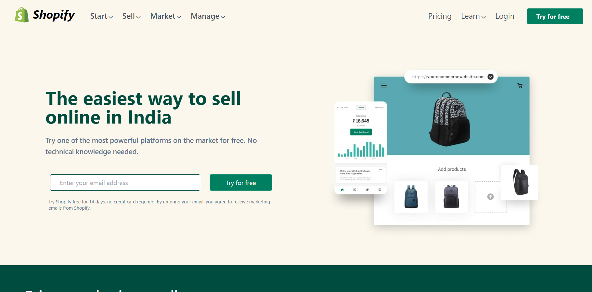
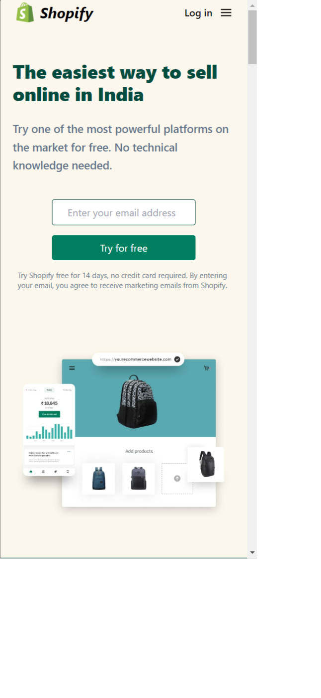

# DISCLAIMER: THIS PAGE WAS MADE AS A PERSONAL EDUCATIONAL PROJECT. This is NOT the official site of the company
# or brand identified on the page. The creator of this page is NOT affilliated with the company of brand in any way.
# This page is a personal project made in connection with an educational exercise.
# Pratiksha Taank

***
## Technology Used
- HTML
- Tailwind CSS
## What I have learn in this project
- How to use Tailwind classes
- How to make a website responsive using tailwind css
## Time Spent
I spent 10 hours to complete this project
## Live Link
Preview the project [Here](https://shopify-clone-twcss.netlify.app/)
## Screenshot

### Mobile Responsive

